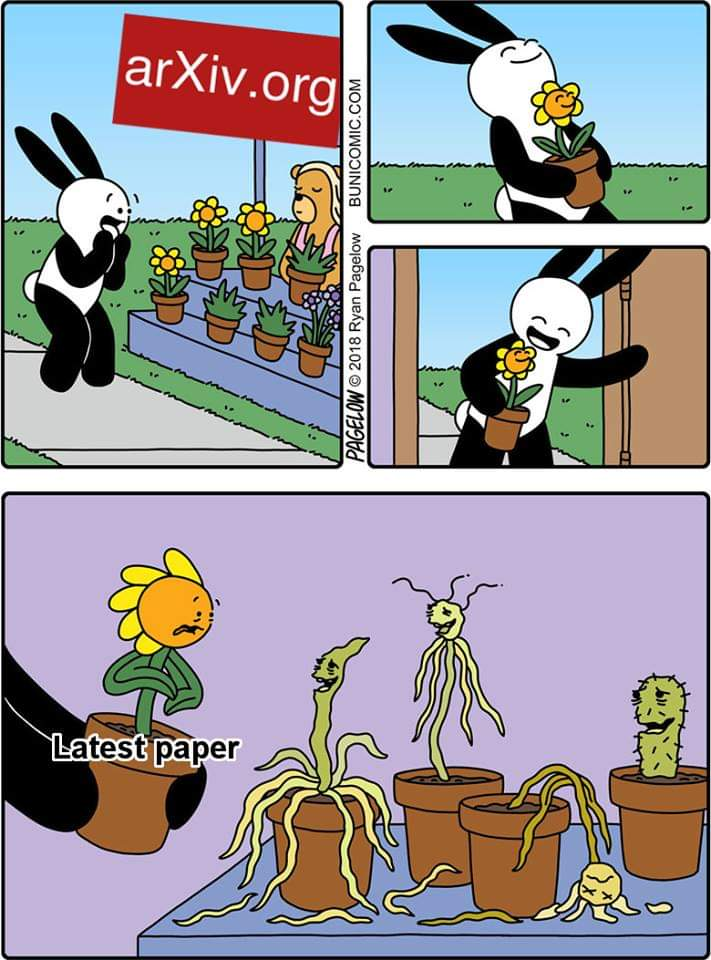

# Please-Read: Paper Notifier that lazy you didn't read.

## Problem Formulation
Repository owner piles up papers and leave them until they extinct. He decided to make an alarm bot for himself to notify his unread papers from his self-made paper table in Notion. Since he is poor, he didn't have any money to run his own personal Linux server and decided to use one of Github Actions.
+ For a certain period (it could be everyday 10AM)
+ Load Notion Paper Database ([API](https://developers.notion.com/reference/intro))
+ Sort papers with priorities, mainly with unread & important papers
+ Automatically wrap this into a pretty markdown
+ and send an email.
+ This periodic process should work Github Actions.
